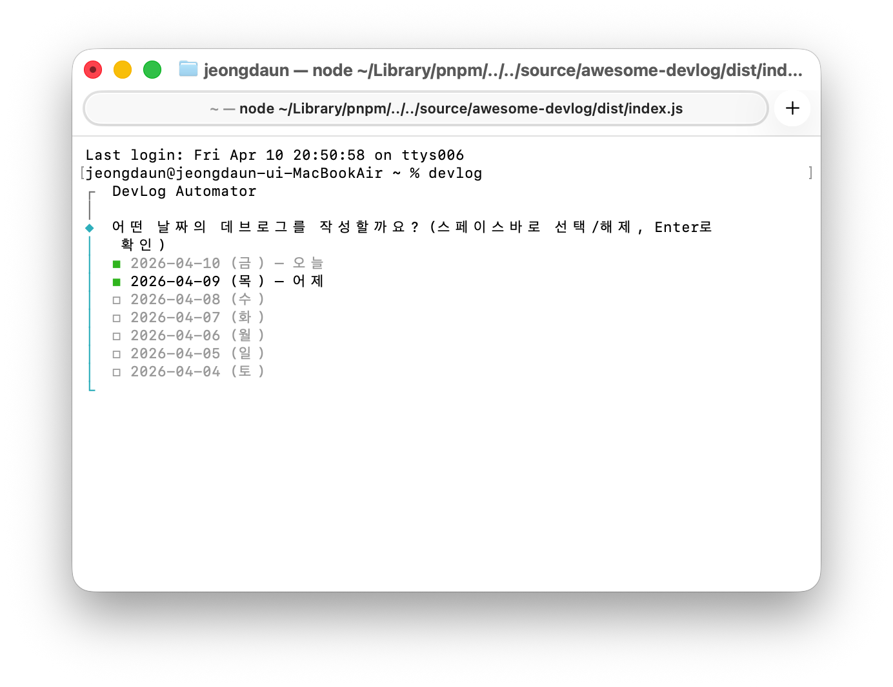
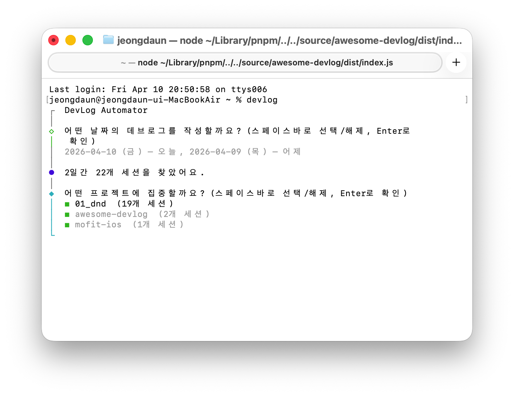
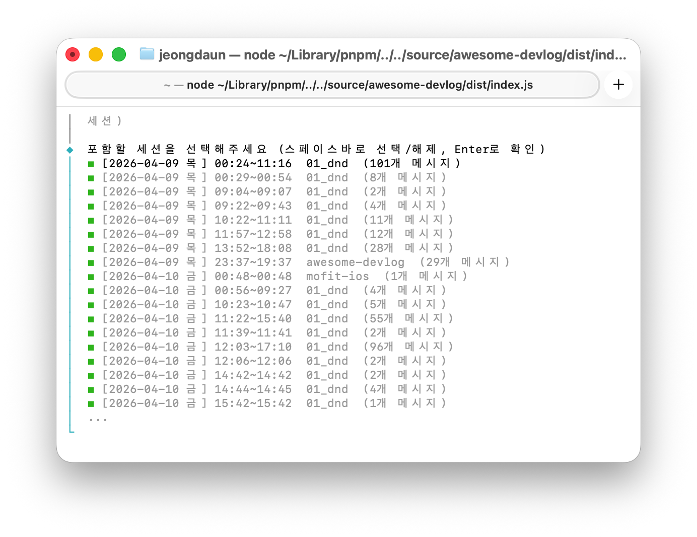
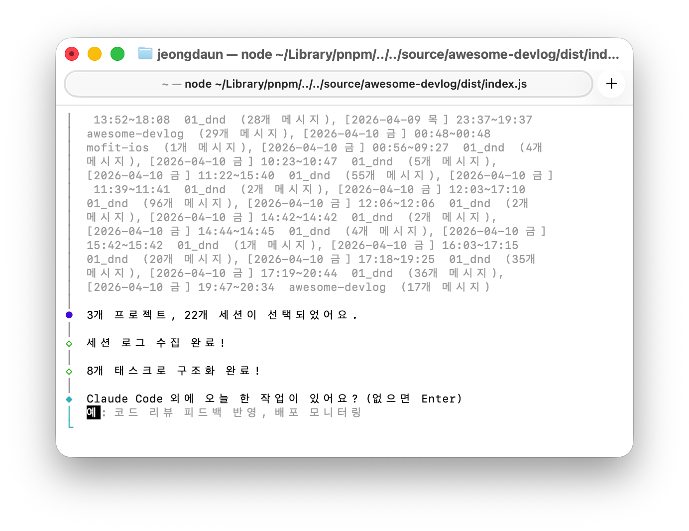
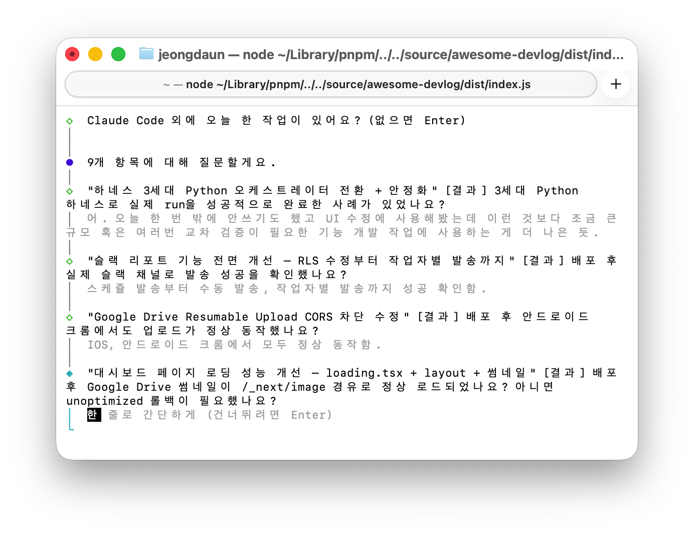

# awesome-devlog

> Claude Code 세션 로그를 자동 수집하고 구조화하여 데브로그를 생성하는 CLI 도구

Claude Code로 작업하면서 쌓인 대화 로그와 git 이력을 자동으로 분석하여, **문제 → 원인 → 해결 → 결과** 구조의 데브로그 초안을 만들어줍니다. 사용자는 핵심 맥락만 보완하면 됩니다.

## 왜 만들었나

- 업무 중 마주치는 문제 해결 과정을 기록하고 싶지만, 실시간으로 정리할 시간이 없다
- Claude Code 대화 로그에 이미 모든 맥락이 담겨 있다
- 이걸 자동으로 수집·분석해서 초안만 만들어주면, 하루 5분이면 데브로그를 완성할 수 있다

## 주요 기능

- **최근 7일 선택** — 날짜, 프로젝트, 세션을 직접 골라서 집중 구조화
- **자동 구조화** — Claude Code CLI로 태스크 단위 분리 + 초안 생성
- **적극적 질문** — 모호한 부분은 추측 대신 질문 (태스크당 최대 5개)
- **프롬프트 수정** — 초안 미리보기 후 자연어로 수정 지시 가능
- **이중 저장** — 시간순 RAW 일지 + 프로젝트별 태스크 일지
- **태스크 매칭** — 같은 작업이면 기존 파일에 자동 append (Claude가 판단)

## 미리보기

### 1. 날짜 선택

최근 7일 중 데브로그를 작성할 날짜를 선택합니다.



### 2. 프로젝트 선택

선택한 날짜에 작업한 프로젝트 목록이 표시됩니다.



### 3. 세션 선택

프로젝트별 세션을 세부적으로 조정할 수 있습니다.



### 4. 자동 구조화

Claude Code가 세션 로그를 분석하여 태스크로 구조화합니다.



### 5. 인터랙티브 질문

로그에서 확인할 수 없는 모호한 부분을 질문합니다.



## 설치

```bash
npm install -g awesome-devlog
```

### 전제 조건

- **Node.js** 22 이상
- **Claude Code CLI** 설치 및 로그인 완료 ([설치 안내](https://docs.anthropic.com/claude-code))

> Claude Code의 기존 인증을 그대로 사용하므로 별도 API 키가 필요 없습니다.

## 사용법

### 초기 설정

```bash
devlog init
```

데브로그 저장 경로를 설정합니다. 설정은 `~/.devlog/config.json`에 저장됩니다.

### 데브로그 생성

```bash
devlog
```

실행하면 다음 흐름으로 진행됩니다:

```
1. 날짜 선택 (최근 7일)
2. 프로젝트 선택
3. 세션 선택
4. Claude가 태스크로 구조화
5. 모호한 부분 질문
6. 배운 점 확인
7. 초안 미리보기 → 수정 or 저장
```

## 저장 구조

```
~/devlog/
├── daily/                              ← 시간순 RAW 일지
│   ├── 2026-04-09_1845.md
│   └── 2026-04-10_1930.md
│
└── projects/                           ← 프로젝트별 일지
    ├── 01_dnd/
    │   ├── CSS 호환성 이슈 수정.md      ← 같은 태스크면 날짜별 append
    │   └── 모바일 카드 UI 추가.md
    └── awesome-devlog/
        └── 날짜 선택 기능 추가.md
```

### 시간순 일지

날짜+시각 기반 파일명으로, 상단에 메타데이터(반영 날짜, 프로젝트별 작업시간)를 포함합니다. 같은 날 여러 번 실행해도 덮어쓰지 않습니다.

### 프로젝트별 일지

프로젝트 폴더 안에 태스크 제목으로 파일이 생성됩니다. 같은 작업을 다른 날에 이어서 했다면, Claude가 판단하여 기존 파일에 날짜별로 이력이 쌓입니다.

## 개발

```bash
# 의존성 설치
pnpm install

# 개발 모드 (watch)
pnpm dev

# 빌드
pnpm build

# 린트 + 포맷 검사
pnpm check

# 린트 + 포맷 자동 수정
pnpm check:fix
```

## 기술 스택

| 항목 | 선택 |
|------|------|
| 언어 | TypeScript (strict) |
| AI | Claude Code CLI (`claude -p`) |
| CLI | @clack/prompts |
| 빌드 | tsup |
| Linter | Biome v2 |

## 기획 문서

상세 기획은 [`docs/`](docs/PLANNING.md)를 참고하세요.

## 라이선스

[MIT](LICENSE)
